# (C# 코딩) SimplePaint

## 개요
- C# 프로그래밍 학습
- 1줄 소개: 그림판 프로그램 구현
- 사용한 플랫폼:
  -C#, .NET Windows Forms, Visual Studio, GitHub
- 사용한 컨트롤:
  - Label, Button, GroupBox, ComboBox, TrackBar, PictureBox
- 사용한 기술과 구현한 기능:
  - GroupBox를 활용하여 도형선택, 색상선택, 선굵기 선택 기능을 구분
  - TrackBar를 활용하여 선굵기 선택 기능 구현
  - ComboBox를 활용하여 색상선택 기능 구현
  - Bitmap과 Graphics를 활용하여 마우스 드래그를 이용한 그림 그리기 기능 구현
  - TracBar.ValueChanged를 활용하여 선굵기 변경 기능 구현
  - Graphics.DrawLine, Graphics.DrawRectangle, Graphics.DrawEllipse를 활용하여 직선, 사각형, 원 그리기 기능 구현
  - cmbColor.SelectedIndexChanged를 활용하여 색상 변경 기능 구현
  - DashStyle.Dash를 활용하여 점선으로 미리보기 기능 구현
  - saveFileDialog를 활용하여 파일 저장 대화상자 구현
  - Bitmap.Save를 활용하여 3가지 포맷으로 저장 기능 구현 / jpg, png, bmp
  - MessageBox.Show를 활용하여 저장 성공 여부 알림 기능 구현
  - OpenFileDialog를 활용하여 파일 열기 대화상자 구현
  - Panel과 AutoScroll을 활용하여 이미지 크기에 맞춰 캔버스 크기 조정 및 스크롤바 구현
  - Width, Height에 배율을 곱하여 마우스 휠로 확대/축소 기능 구현

## 실행 화면 (과제1)
- 과제1 코드의 실행 스크린샷

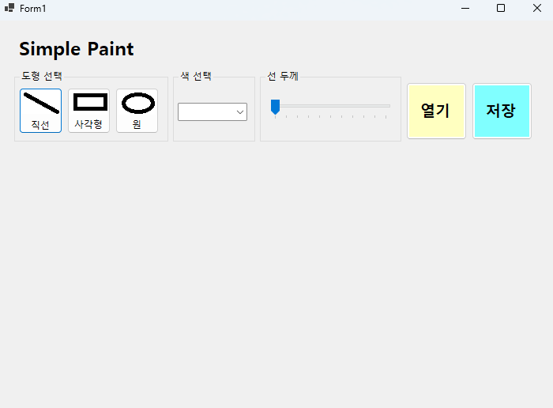
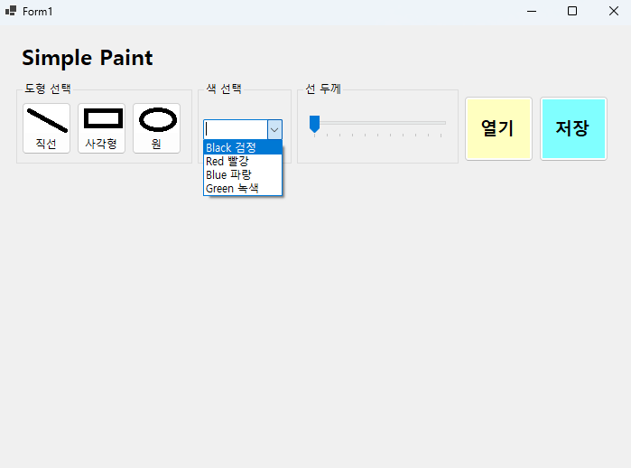
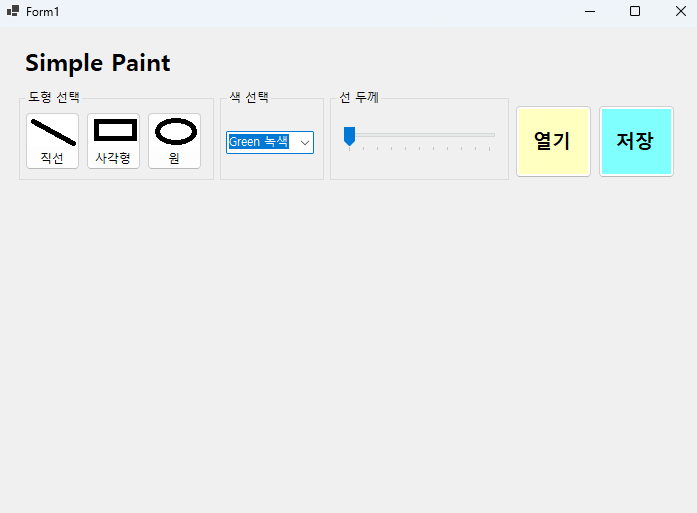
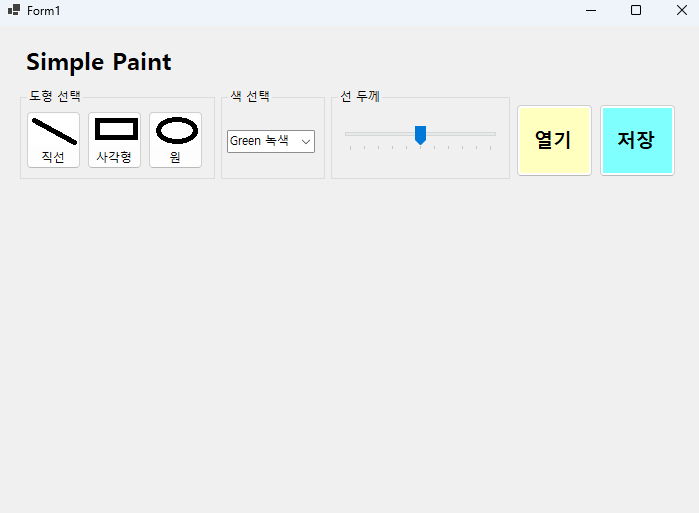

- 과제 내용
  - UI 구성
  - 컨트롤에서 기본적으로 제공하는 기능 구동 확인
  - 도형선택, 색상선택, 선굵기 선택 기능 구현

- 구현 내용과 기능 설명
  - GroupBox를 활용하여 도형선택, 색상선택, 선굵기 선택 기능을 구분
  - TrackBar를 활용하여 선굵기 선택 기능 구현
  - ComboBox를 활용하여 색상선택 기능 구현

## 실행 화면 (과제2)
- 과제2 코드의 실행 스크린샷

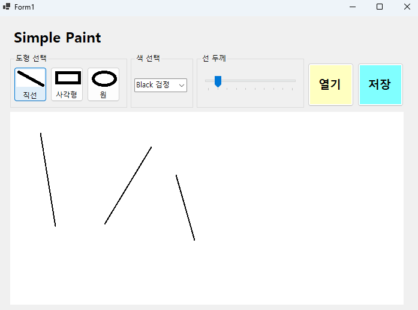
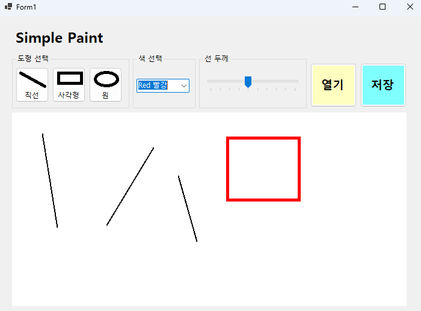
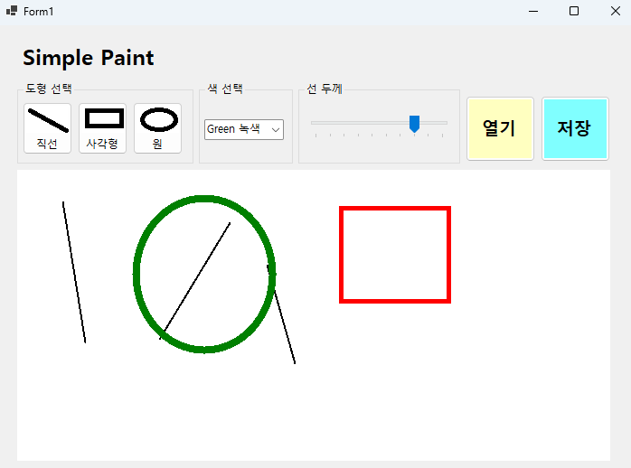
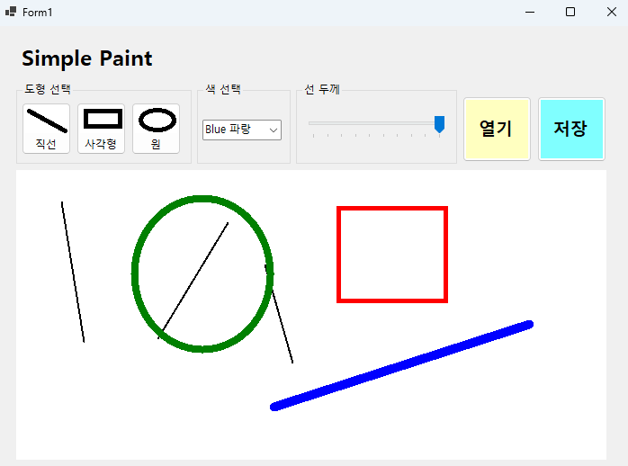

- 과제 내용
  - 마우스 드래그를 이용한 그림 그리기 기능 구현
  - 직선, 사각형, 원그리기 기능구현

- 구현 내용과 기능 설명
  - Bitmap과 Graphics를 활용하여 마우스 드래그를 이용한 그림 그리기 기능 구현
  - TracBar.ValueChanged를 활용하여 선굵기 변경 기능 구현
  - Graphics.DrawLine, Graphics.DrawRectangle, Graphics.DrawEllipse를 활용하여 직선, 사각형, 원 그리기 기능 구현
  - ComboBox.SelectedIndexChanged를 활용하여 색상 변경 기능 구현
  - DashStyle.Dash를 활용하여 점선으로 미리보기 기능 구현

## 실행 화면 (과제3)
- 과제3 코드의 실행 스크린샷

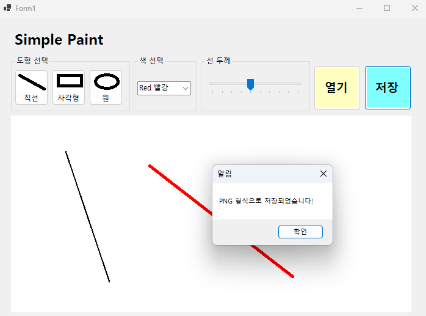

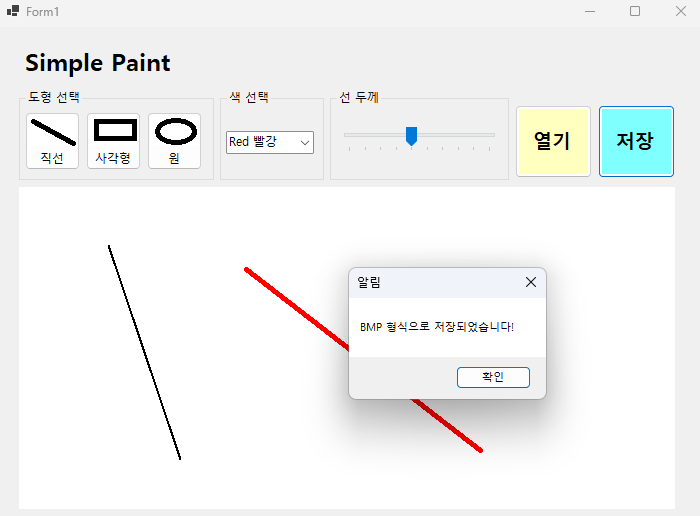
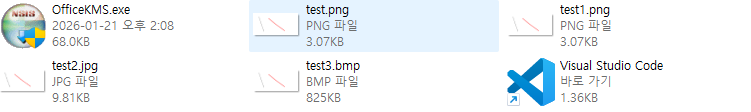

- 과제 내용
  - 파일 저장을 위한 대화상자인 SaveFileDialog 사용
  - 3가지 포맷으로 저장

- 구현 내용과 기능 설명
  - saveFileDialog를 활용하여 파일 저장 대화상자 구현
  - Bitmap.Save를 활용하여 3가지 포맷으로 저장 기능 구현 / jpg, png, bmp
  - MessageBox.Show를 활용하여 저장 성공 여부 알림 기능 구현

## 실행 화면 (과제4)
- 과제4 코드의 실행 스크린샷

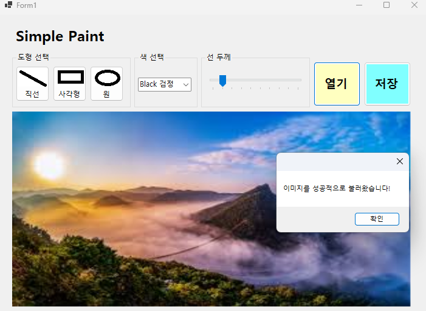
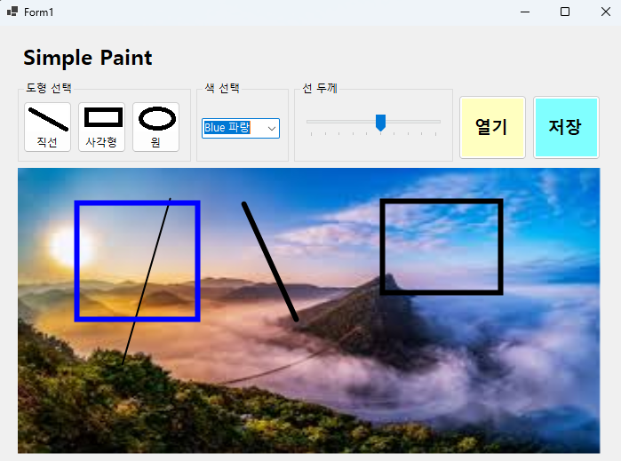
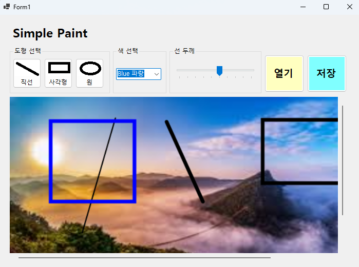
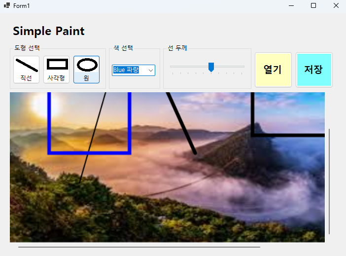

- 과제 내용
  - 외부에서 이미지 파일을 읽어들여서 캔버스로 사용
  - 이미지 크기에 맞춰 캔버스 크기 조정
  - 이미지 크기가 큰 경우 스크롤바 만들기
  - 확대/축소 기능 넣기

- 구현 내용과 기능 설명
  - OpenFileDialog를 활용하여 파일 열기 대화상자 구현
  - Panel과 AutoScroll을 활용하여 이미지 크기에 맞춰 캔버스 크기 조정 및 스크롤바 구현
  - Width, Height에 배율을 곱하여 마우스 휠로 확대/축소 기능 구현
  - 이미지가 큰 경우 스크롤바가 나타나도록 구현